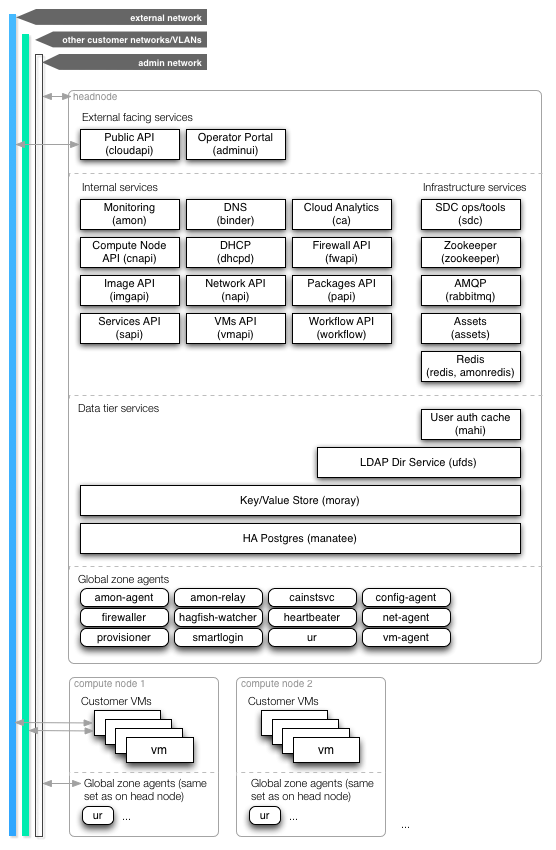

<!--
    This Source Code Form is subject to the terms of the Mozilla Public
    License, v. 2.0. If a copy of the MPL was not distributed with this
    file, You can obtain one at http://mozilla.org/MPL/2.0/.
-->

<!--
    Copyright (c) 2014, Joyent, Inc.
    Copyright 2022 MNX Cloud, Inc.
-->

# SmartDataCenter Architecture

SmartDataCenter (SDC) is designed with a very specific vision of how a
datacenter should be organized. The overall architecture diagram is as
follows:

<map name="GraffleExport">
	<area shape=rect coords="76,112,174,142" href="https://github.com/TritonDataCenter/sdc-cloudapi/blob/master/docs/index.md">
	<area shape=rect coords="182,112,280,142" href="https://docs.joyent.com/sdc7/operations-portal-walkthrough">
</map>

The following sections explain the diagram in more detail.

## SmartOS as hypervisor

All systems in SDC use [SmartOS](http://smartos.org) as their hypervisor. This
means that most of the [Global Zone](../glossary.md#global-zone)'s operating
system filesystem is read-only. Notable exceptions to this are `/zones`, where
VMs are stored, and `/opt`, where agents are installed.

The Global Zone is only ever used to run operator infrastructure. All customer
activity is run in non-global zones. Non-agent SDC services are run in
non-global zones - see the [services section](#Services) below.

## Headnode

SDC is architected so that the initial system booted in a datacenter is the
**headnode**, which hosts all of the service VMs. This system is not intended to
host customer VMs - it is for the administration of the rest of the nodes.

## Compute Nodes

All non-headnode machines in the datacenter are **compute nodes**, which are
meant for provisioning customer VMs. These nodes are booted over the network
from the headnode.

## Agents

SDC communicates with the Compute Nodes through [agents](../glossary.md#agent)
that run in the [Global Zone](../glossary.md#global-zone) on each compute node.
These agents serve a variety of functions including control operations for
customer VMs, monitoring and log collection. The
[ur agent](https://github.com/TritonDataCenter/sdc-ur-agent) is the initial agent used
for bootstrapping all other agents.

See the [reference](../reference.md#agents) for more information about
agents.

## Networks

SDC requires two separate layer 2 subnets for operation. The **admin network**
is used for internal SDC communication and network booting compute nodes. Since
this is the control plane for SDC, customers are not allowed to provision VMs
on this network. For security reasons, this network should not be routable.

The other required network is the **external network**. This is used for SDC
VMs that require access to the internet. For example, the Global Zone may
require internet access for NTP, and
[IMGAPI](https://github.com/TritonDataCenter/sdc-imgapi) can be configured to fetch
images from Joyent image servers. This is also the network that administrative
endpoints ([Admin UI](https://github.com/TritonDataCenter/sdc-adminui) and
[cloudapi](https://github.com/TritonDataCenter/sdc-cloudapi)) can be configured to listen
on to avoid giving their users access to the admin network.

Customer networks are separate from the two standard SDC networks -- the number
of them is limited by the number of VLANs.

Compute node Global Zones are not given externally routable IP addresses -- only
addresses on the admin network. This is meant to minimize potential intrusion
points and avoid using public IPs that could be used by customers.  VMs
provisioned on those compute nodes can still have nics with externally routable
addresses, just not the Global Zone.

## Services

SDC employs a service-oriented architecture. Operator functionality is split
into a number of different services, which can be administered and updated
independently. The services are distributed as virtual machine images. This
allows the service and its local dependencies to be updated as one unit, and
allows for simple upgrades and rollbacks.

See the [reference](../reference.md#services) for more information about
services.

### External facing services

The external facing services are the administrative endpoints for SDC.
[CloudAPI](https://github.com/TritonDataCenter/sdc-cloudapi) provides an API for
customers to administer their VMs, and
[Admin UI](https://github.com/TritonDataCenter/sdc-adminui) provides a web API for
operators to administer SDC. They both communicate with the internal services
to perform administrative actions.

These services are stateless - they rely on the data tier services for
persistence.

### Internal services

The internal services offer a variety of functionality related to the operation
of SDC. The external facing services and APIs communicate with them to perform
tasks, and they in turn communicate with the agents on the Compute Nodes. Most
of the services are REST-based, though notable exceptions include:

- [dhcpd](https://github.com/TritonDataCenter/sdc-booter): used to TFTP boot Compute
  Nodes and assign them IP addresses
- [rabbitmq](https://github.com/TritonDataCenter/sdc-rabbitmq): provides an AMQP message
  queue for communicating with Compute Node agents
- [sdc](https://github.com/TritonDataCenter/sdc-sdc): provides CLI tooling and
  miscellaneous administrative services

See the [reference](../reference.md#services) and
[SDC repositories overview](./repos.md) for information about the individual
services.

These services are stateless -- they rely on the data tier services for
persistence.

### Data tier services

The data tier services offer storage for the internal and external facing
services:

- [UFDS](https://github.com/TritonDataCenter/sdc-ufds): LDAP Server
- [mahi](https://github.com/TritonDataCenter/mahi): User authentication cache for UFDS
- [moray](https://github.com/TritonDataCenter/moray): key/value store

These services use [manatee](https://github.com/TritonDataCenter/manatee), a Highly
Available PostgreSQL service, for their storage.
