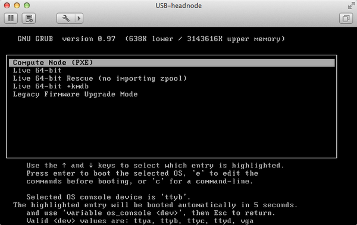
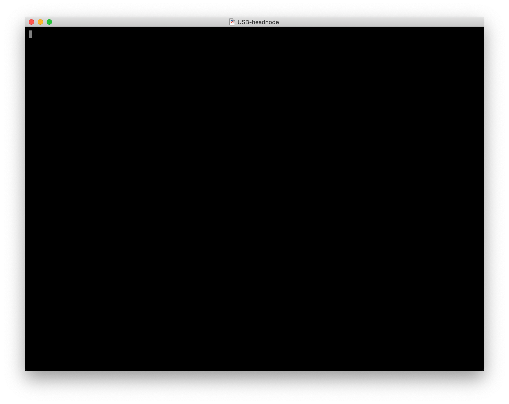
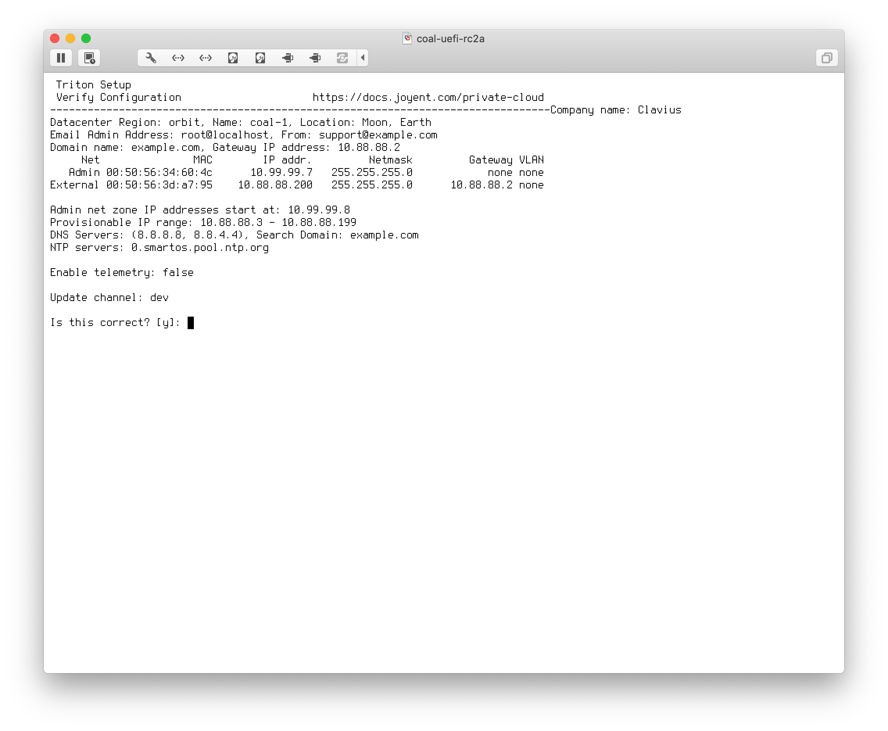
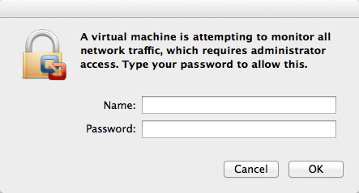
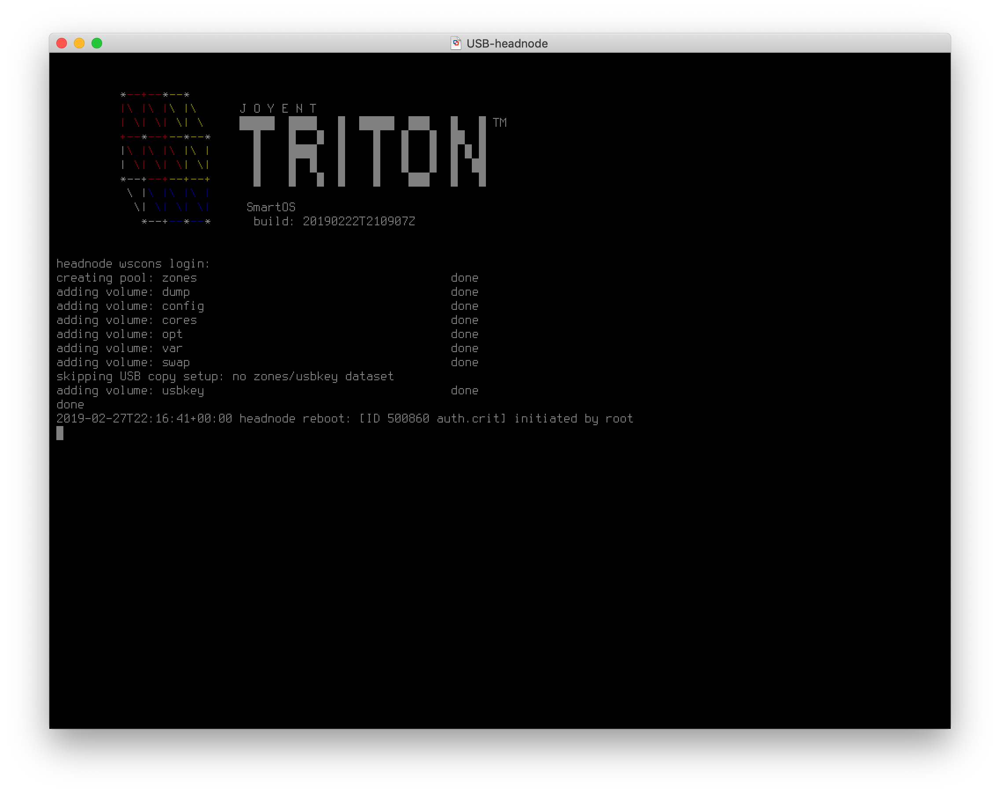
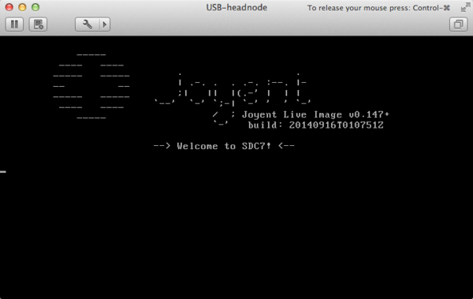
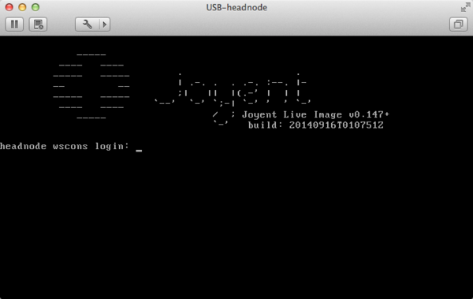
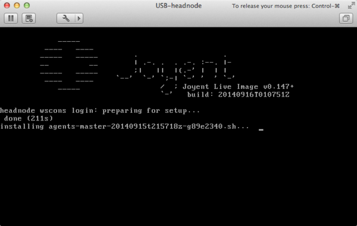
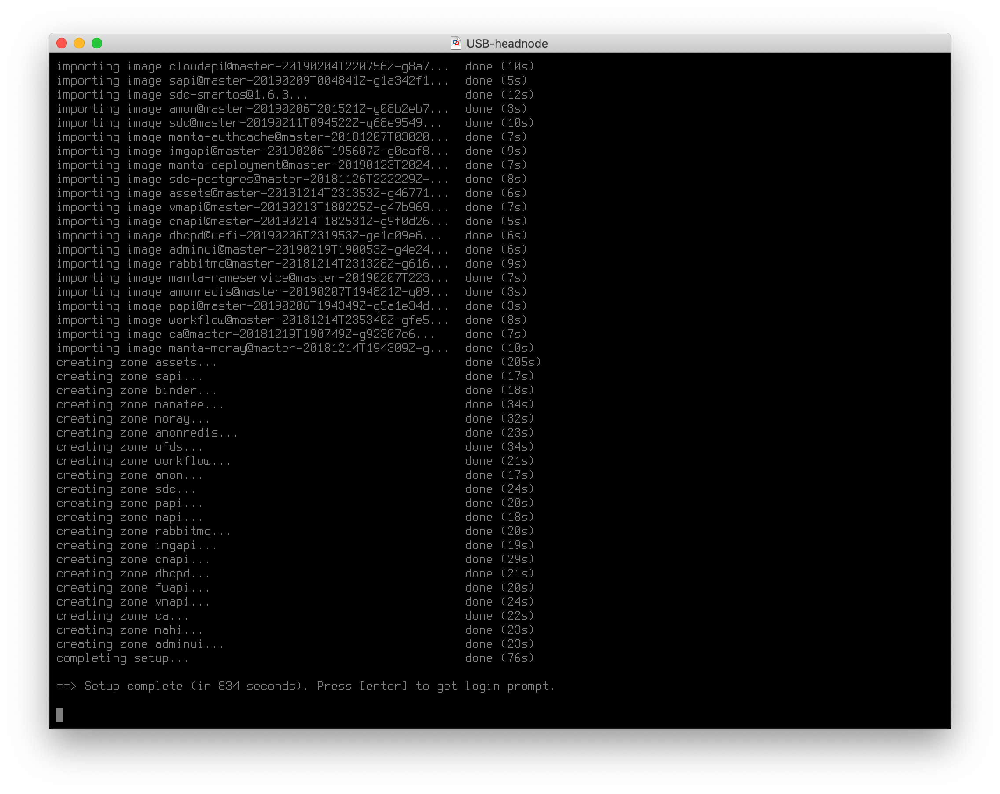

<!--
    This Source Code Form is subject to the terms of the Mozilla Public
    License, v. 2.0. If a copy of the MPL was not distributed with this
    file, You can obtain one at http://mozilla.org/MPL/2.0/.
-->

<!--
    Copyright (c) 2014, Joyent, Inc.
-->

# CoaL Setup

CoaL stands for "Cloud on a Laptop". It is a VMware virtual appliance for
a SmartDataCenter headnode. It's useful for developing and testing
SmartDataCenter (SDC). This document walks through setting up CoaL.

See [the SDC project README](https://github.com/joyent/sdc#cloud-on-a-laptop-CoaL)
for the VMware desktop software required and where to download
a recent CoaL build.

At a high level the CoaL setup procedure is:

1. Boot the VMware appliance (virtual machine).
2. SmartDataCenter console configuration wizard.
3. On reboot with a configuration the SDC services (zones and agents) are
   installed and setup in the virtual machine: SDC headnode. This can
   take from 10 to 20 minutes on a Mac laptop.
4. Log in to the virtualized SDC headnode and play, test and develop.


## Quick Path

### Run CoaL on VMware

1. Unpack the CoaL build that you downloaded.

    - Mac:

        ```bash
        $ tar xvzf coal-latest.tgz
        x root.password.20140911t161518z
        x coal-master-20140911T194415Z-g1a445f5-4gb.vmwarevm/
        x coal-master-20140911T194415Z-g1a445f5-4gb.vmwarevm/USB-headnode.vmx
        x coal-master-20140911T194415Z-g1a445f5-4gb.vmwarevm/zpool.vmdk
        x coal-master-20140911T194415Z-g1a445f5-4gb.vmwarevm/USB-headnode.vmdk
        x coal-master-20140911T194415Z-g1a445f5-4gb.vmwarevm/4gb.img
        ...
        ```


1. Start VMware and load the appliance.

    - Mac: 'open'ing the folder will start VMware and "open and run" the vm:

            open coal-<branch>-<build_date_time>-<git_sha1_hash>-4gb.vmwarevm

1. When you are prompted with the GRUB menu press the "down" arrow.

  1. Select the "Live 64-bit" option and press 'c' to enter the command
     line for GRUB.

     By default, the OS will redirect the console to ttyb which is fine
     for production but needs to be changed for CoaL. While in the command line:

            grub> variable os_console vga

  1. Press enter.  

  1. Press esc to get back to the GRUB menu.

  1. Boot "Live 64-bit" by pressing enter.

### Configure the Headnode

Use the following table to quickly configuration your CoaL with settings that
are fine for development. The table is followed by screenshots.

If you make a mistake while entering the configuration you can restart
the VMware virtual machine. Also, as the onscreen instructions describe,
the last step in configuration allows editing the resulting configuration file.

|Setting|Value|Notes|
|---|---|---|
|*Instructions*|↵||
|Company Name|Clavius|*Can substitute with your choice.*|
|Region of Datacenter|orbit|*Can substitute with your choice.*|
|Name of Datacenter|coal-1|(Availability zone.) *Can substitute with your choice.* |
|Location of DataCenter|Moon, Earth|*Can substitute with your choice.*|
|*Instructions*|↵||
|'admin' interface|2|The second NIC is set up as the admin network by the CoaL networking script|
|(admin) headnode IP address|10.99.99.7|Must use this value.|
|(admin) headnode netmask:|↵|Use the default.|
|(admin) Zone's starting IP address:|↵|Use the default.|
|Add external network now? (Y/n)|Y|Must use this value.|
|'external' interface|1|The first NIC is set up as the external network by the CoaL networking script|
|(external) headnode IP address|10.88.88.200|Must use this value.|
|(external) headnode netmask:|↵|Use the default.|
|(external) gateway IP address:|10.88.88.2|Must use this value.|
|(external) network VLAN ID|↵|Use default. The external network is not on a VLAN in CoaL|
|Starting Provisionable IP address for external Network|↵|Use the default.|
|Ending Provisionable IP address for external Network|↵|Use the default.|
|Default gateway IP address:|↵|Use the default.|
|Primary DNS Server|↵|Use the default.|
|Secondary DNS Server|↵|Use the default.|
|Head node domain name|example.com|*Can substitute with your choice.*|
|DNS Search Domain|example.com|*Can substitute with your choice.*|
|NTP Server IP Address|↵|Use the default.|
|"root" password|rootpass|*Can substitute with your choice.*|
|Confirm "root" password|||
|"admin" password|adminpass1|*Can substitute with your choice.*|
|Confirm "admin" password|||
|Administrator's email|↵|Use the default.|
|Support email|↵|Use the default.|
|Confirm password|||
|Enable telemetry|"true" or "false"|*Can use your choice*|
|Verify Configuration||See screenshot below.|
|Verify Configuration Again|||


## Installation

CoaL will now install based on the configuration parameters entered
above. Installation has been observed to take up to 20 minutes,
particularly if slow laptop HDD.

### Screenshots

- CoaL Grub Boot Menu:



- If while booting it stays just showing a cursor then you might have forgotten
to redirect the console (see above):



- On boot, being in a virtual environment, you'll receive CPU and KVM warnings:


- Verify configuration:



- On a Mac, you will be prompted to enter your admin password, so that the
VM can monitor all network traffic. You may receive this popup a few times:



- The next phase of installation completes with notification of a reboot:



- The final phase of installation, setup, is the longest and does not show
the progress at the beginning of it. You may see either:

A)



B)



- After sometime you will see, preparing for setup:



- Finally, when setup is complete you'll see:




## Post Installation

After setup is complete you should be able to SSH into your CoaL on the
"admin" network. Example:

```bash
ssh root@10.99.99.7  # password 'rootpass'
```

For just a taste run `svcs` to see running [SMF services](http://wiki.smartos.org/display/DOC/Using+the+Service+Management+Facility).
Run `vmadm list` to see a list of current VMs (SmartOS
[zones](http://wiki.smartos.org/display/DOC/Zones)). Each SDC service runs in
its own zone. See [the Joyent customer operator guide](https://docs.joyent.com/sdc7).


## Additional Configuration and Services

The base setup of a SmartDataCenter headnode is minimal. In short it is
everything up to and including the [operator portal](../glossary.md#operator-portal).
There is no customer public API instance (CloudAPI) and no services
have been given access to the "external" network (locked down by default).
See the [Joyent customer post-installation configuration
documentation](https://docs.joyent.com/sdc7/installing-sdc7/post-installation-configuration)
for others and instructions.
