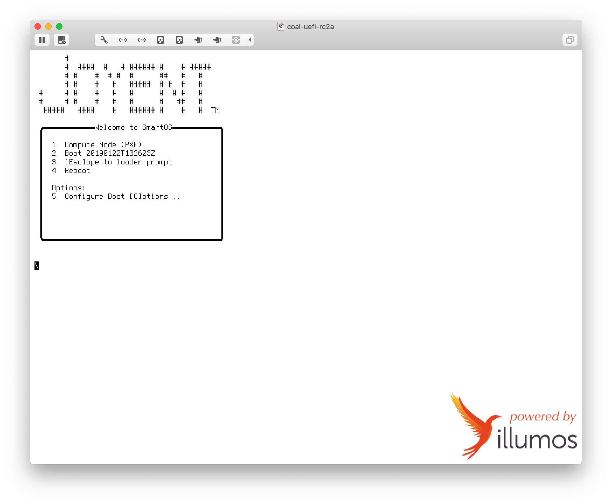
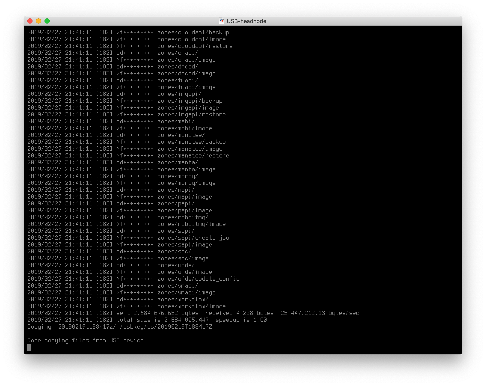

<!--
    This Source Code Form is subject to the terms of the Mozilla Public
    License, v. 2.0. If a copy of the MPL was not distributed with this
    file, You can obtain one at http://mozilla.org/MPL/2.0/.
-->

<!--
    Copyright (c) 2019, Joyent, Inc.
-->

# Cloud on a Laptop (CoaL)

CoaL is a VMware appliance that is a full [Triton](https://docs.joyent.com/private-cloud)
head node for development and testing. Because most Joyent developers work on Macs,
this document walks through the process of setting up CoaL on a Mac. Read this
document carefully before installing CoaL.

**Note**: Developers in the community have set up CoaL successfully on Windows and
on Linux using these instructions as general guidelines, modifying them as needed.

**WARNING**: The installation procedure and configuration options in this document
are not appropriate for production deployments.


## Minimum Requirements

The minimum requirements for a good CoaL experience are a Mac with 16 GB RAM and
an SSD with 45 GB of disk space available.

## Overview

The high-level steps for setting up CoaL are:

1. Downloading the latest CoaL build.
2. Downloading, installing, and configuring VMware.
3. Extracting and loading CoaL.
4. Booting the VMware appliance (virtual machine).
5. Configuring the head node.
6. Installing Triton (10 to 20 minutes).
7. Testing and developing.

## Downloading CoaL

The CoaL tarball is approximately 3 GB and will take some time to download.

To download the latest CoaL build:

```
curl -C - -O https://us-east.manta.joyent.com/Joyent_Dev/public/SmartDataCenter/coal-latest.tgz
```

While you wait for the tarball download to complete, you can configure and
install VMware.

## Downloading, installing, and configuring VMware

Most Joyent team members run CoaL from VMware Fusion. We recommend VMware
version 8.5.3, but users have had success with v5 and v8.

1. Download [VMware Fusion](http://www.vmware.com/products/fusion).  
**Note**: For Windows or Linux, download VMware Workstation from
[VMware Workstation](http://www.vmware.com/products/workstation).
1. Install VMware.
1. When complete, launch the application to confirm that it installed correctly.
1. Close VMware.

To configure CoaL's external and admin networks:

- Mac
    ```bash
    curl -s https://raw.githubusercontent.com/joyent/triton/master/tools/coal-mac-vmware-setup | sudo bash
    ```

- Linux
    ```bash
    curl -s https://raw.githubusercontent.com/joyent/sdc/master/tools/coal-linux-vmware-setup | sudo bash
    ```

- Windows

    Download https://raw.githubusercontent.com/joyent/triton/master/tools/coal-windows-vmware-setup.bat
    and run `coal-windows-vmware-setup.bat`.

## Extracting and loading CoaL

To extract the CoaL virtual machine:

```bash
$ tar -zxvf coal-latest.tgz -C ~/Documents/Virtual\ Machines.localized
x root.password.20190122T132623z
x coal-master-20190122T132623Z-g1a445f5-4gb.vmwarevm/
x coal-master-20190122T132623Z-g1a445f5-4gb.vmwarevm/USB-headnode.vmx
x coal-master-20190122T132623Z-g1a445f5-4gb.vmwarevm/zpool.vmdk
x coal-master-20190122T132623Z-g1a445f5-4gb.vmwarevm/USB-headnode.vmdk
x coal-master-20190122T132623Z-g1a445f5-4gb.vmwarevm/4gb.img
...
```

To load the CoaL appliance:
1. Launch **VMware Fusion**.
1. Select **File** and then click **Open**.
1. Navigate to and select the `.vmwarevm` file that contains the CoaL build.  
   **Note**: If you are working from the command line instead of the GUI, run:
   ```
   open coal-<branch>-<build_date_time>-<git_sha1_hash>-4gb.vmwarevm
   ```

To configure memory:

1. Select **Virtual Machine** and then click **Settings**.  
   The **USB-headnode Settings** dialog displays.
2. Click **Processes & Memory**. Change the memory settings, if needed.  
   **Note**: The default memory is set to 8192 MB. You can change this setting,
   but be sure to leave Mac OS X with at least 8 GB to avoid resource allocation
   problems. If you are not using the VMware GUI, you can change the default
   memory in the CoaL `USB-headnode.vmx` file. You can set memsize = "6144",
   or according to your preference.
3. If you have changed the memory settings, restart the VM.


## Booting the head node

1. When you are prompted with the Loader menu press **'5'** to go to the Boot
Options menu.

     

     By default, the OS will redirect the console to ttyb which is fine
     for production but needs to be changed for CoaL.  Once in the Boot
     Options menu, press **'2'** to cycle through the choices for **OS Console**
     until the value is **'text'**, as shown below:

     

2. Press **'1'** to return to the main menu.

3. Press **'2'** to boot from the USB stick.


**Note**: If you see a blank screen with a cursor at the top left while the head
node is booting, you may have forgotten to redirect the console.


**Note**: Because you are in a virtual environment without Intel VT-x support
enabled, you'll receive CPU warnings. You can safely ignore them:


## Configuring the head node

Use the following table to configure the development settings for CoaL. In many
cases, you will choose the default values. In others, you must type the literal
value provided. Variables are in *italics*. You can set any value for variables.

The final prompt asks that you verify the configuration settings. If you have
made a mistake, you can reject the settings and restart the configuration process.

|Setting|Value|Notes|
|---|---|---|
|*Instructions*|↵||
|Company Name|*Clavius*|You can give the company name any value.|
|Data center region|*orbit*||
|Data center name|*coal-1*|Also known as the availability zone (AZ).|
|Data center location|*Moon*, *Earth*||
|admin interface|**2**|Type **2**. The second NIC is set up as the admin network by the CoaL networking script|
|(admin) headnode IP address|**10.99.99.7**|Type **10.99.99.7** to specify the IP address.|
|(admin) headnode netmask:|↵|Press **Enter** to select the default.|
|(admin) Zone's starting IP address:|↵|Press **Enter** to select the default.|
|Add external network now?|**Y**|Type **Y** to add the external network, or press **Enter** to select the default.|
|'external' interface|**1**|Type **1**. The first NIC is set up as the external network by the CoaL networking script|
|(external) headnode IP address|**10.88.88.200**|Type **10.88.88.200** to specify the IP address.|
|(external) headnode netmask:|↵|Press **Enter** to select the default.|
|(external) gateway IP address:|**10.88.88.2**|Type **10.88.88.2** to specify the gateway IP address.|
|(external) network VLAN ID|↵|Press **Enter** to select the default. The external network is not on a VLAN in CoaL|
|Starting Provisionable IP address for external Network|↵|Press **Enter** to select the default.|
|Ending Provisionable IP address for external Network|↵|Press **Enter** to select the default.|
|Default gateway IP address:|↵|Press **Enter** to select the default.|
|Primary DNS Server|↵|Press **Enter** to select the default.|
|Secondary DNS Server|↵|Press **Enter** to select the default.|
|Head node domain name|*example.com*|The domain name should be unique($dc.domain should not publicly resolve).|
|DNS Search Domain|*example.com*|The search domain should be unique.|
|NTP Server IP Address|↵|Press **Enter** to select the default.|
|Set root password|**rootpass**|Type **rootpass** to set the root password.|
|Confirm root password|||
|Set admin password|**adminpass1**|Type **adminpass1** to set the admin password.|
|Confirm admin password|||
|Administrator email|↵|Press **Enter** to select the default.|
|Support email|↵|Press **Enter** to select the default.|
|Enable telemetry|↵|Press **Enter** to select the default, false.|
|Default channel|**release**|Enter **release** to download stable versions by default, or enter another preferred channel.|
|Verify configuration settings|↵|Review the configuration before proceeding. If the configuration is not correct, type **n** to reject the settings and restart the process.|
|Confirm configuration|↵|If you verified the configuration settings, you are prompted to confirm them.|

The Verify Configuration prompt looks something like:


## Installing Triton

CoaL will now install the Triton head node based on the configuration. The
installation can take up to 20 minutes. Installation isn’t complete until the
**Setup complete** message displays.

On a Mac, you will be prompted to enter your admin password several times to
enable the VM to monitor all network traffic:


A reboot notification displays when the next phase of installation completes:


After the system reboots, images and manifests from the USB key are copied into
a cache in the zones ZFS pool.  This process can take several minutes:



The final and longest phase of installation involves importing and provisioning
the Triton service images.  When the installation completes, **Setup complete**
displays.


## Testing and Developing

### Root Access

After setup is complete you should be able to SSH into CoaL using the admin
network headnode IP address you configured. For example:

```bash
ssh root@10.88.88.200  # password 'rootpass'
```

### Health checks

Performing health checks is a best practice. You can check the health of CoaL
using `sdcadm health` before/after rebooting or updating CoaL.

To confirm the health of the services:

```bash
root@headnode (coal-1) ~]# sdcadm health
INSTANCE                              SERVICE          HOSTNAME  ALIAS       HEALTHY
b25f30b0-e8dc-46e8-a3a3-58e5272b5c16  adminui          headnode  adminui0    true
1ca8a319-0257-44d5-95a4-64419c7f1ebd  amon             headnode  amon0       true
1555209d-9d88-4216-a0ff-3a8eec8117a5  amonredis        headnode  amonredis0  true
cee69840-7778-4cff-872a-5696fef22aff  assets           headnode  assets0     true
672f2081-0ee4-4815-a523-e0baf80457bd  binder           headnode  binder0     true
1391af6e-da4a-49d3-8eba-ebb4e2e276c3  ca               headnode  ca0         true
68f59f8f-bed8-46d0-a08b-99628d524e44  cnapi            headnode  cnapi0      true
8654d01f-b6f5-4462-a4cf-248944384fbb  dhcpd            headnode  dhcpd0      true
1774528c-c960-4e3e-8d5c-858c5e4b73de  fwapi            headnode  fwapi0      true
8f9ee32c-73b0-4ea5-a685-c2fd9141edf0  imgapi           headnode  imgapi0     true
df0cfe72-6067-450d-bf98-760ed3009783  mahi             headnode  mahi0       true
9f93657d-2a8d-44fc-831b-f609b22aa3e6  manatee          headnode  manatee0    true
46b4278d-08c5-4267-9b89-914eaf0c4cd9  moray            headnode  moray0      true
796f56af-78b1-4a2b-a364-ad1eed275e3a  napi             headnode  napi0       true
099c7c92-a5e5-42c0-84c2-0774584c808d  papi             headnode  papi0       true
69980f40-2bfc-4673-8321-38d22e74eea6  rabbitmq         headnode  rabbitmq0   true
c7cfcfaa-5369-4236-8ed9-96796d3a9ef5  sapi             headnode  sapi0       true
f30cb983-f1fe-43d0-b093-31b2c5006b01  sdc              headnode  sdc0        true
247f7e5f-e353-46c5-b615-eab326a96089  ufds             headnode  ufds0       true
a1e8c136-2fed-4cd1-b3f6-0ec92ecc073e  vmapi            headnode  vmapi0      true
c47c1b9f-e349-493c-b7d2-4c3a51fd2f21  workflow         headnode  workflow0   true
564de8b3-3203-b2d7-402b-3698369f114f  global           headnode  global      true
e80eb8a6-3c53-4ce5-b7b9-6f8bd174a010  amon-agent       headnode  -           true
618fbb3b-bb5b-49b7-92ff-b8fb5a27e706  amon-relay       headnode  -           true
03323225-bd5d-4978-b0a5-6ef59be16f9d  cmon-agent       headnode  -           true
479f9013-73f7-416e-9b16-66486f638195  cn-agent         headnode  -           true
7084a8b5-7646-406f-a134-97f2a8beb3f0  config-agent     headnode  -           true
b2fa15f7-b245-4e5a-ad31-b1790f95b77c  firewaller       headnode  -           true
f32aa368-1632-47b9-a2bc-1079a550a9d2  hagfish-watcher  headnode  -           true
a411b34d-f1f2-4a16-9454-fb7cb8c21e7c  net-agent        headnode  -           true
efadb38d-6f53-4d94-bacc-29c04d56a076  smartlogin       headnode  -           true
eadc8725-8dc7-4d67-82ea-3ca081b821ae  vm-agent         headnode  -           true
```

### Adding external Nics

External NICs are required to access remote update sources and the
AdminUI via a browser.

To add external nics to `imgapi` and `adminui`:
   ```bash
   [root@headnode (coal-1) ~]# sdcadm post-setup common-external-nics
   Added external nic to adminui
   Added external nic to imgapi
   ```
   **Note**: This command does not wait for the `add nics` jobs to
   complete. Once you submit the command, you might need to wait after
   the command exits until you are sure that the jobs really finish.

To confirm which services have an external IP, run `sdc-vmapi`:
   ```bash
    root@headnode (coal-1) ~]# sdc-vmapi /vms?state=running | json -H -ga alias nics.0.ip nics.1.ip
    dhcpd0 10.99.99.9
    imgapi0 10.99.99.21 10.88.88.4
    sdc0 10.99.99.28
    workflow0 10.99.99.19
    napi0 10.99.99.10
    fwapi0 10.99.99.26
    assets0 10.99.99.8
    moray0 10.99.99.17
    ufds0 10.99.99.18
    redis0 10.99.99.24
    sapi0 10.99.99.32
    vmapi0 10.99.99.27
    cnapi0 10.99.99.22
    binder0 10.99.99.11
    amonredis0 10.99.99.23
    rabbitmq0 10.99.99.20
    manatee0 10.99.99.16
    papi0 10.99.99.29
    amon0 10.99.99.25
    ca0 10.99.99.30
    mahi0 10.99.99.33
    adminui0 10.99.99.31 10.88.88.3
   ```

To test whether you can access the AdminUI via the external IP address,
in a web browser on the host computer, navigate to https://10.88.88.3.

### Setting up CloudAPI for development

CloudAPI provides the self-serve API access to Triton. If you are developing
or testing against CloudAPI, you can install it by running:
   ```bash
   root@headnode (coal-1) ~]# sdcadm post-setup cloudapi
   cloudapi0 zone created
   ```

If you plan to use CloudAPI in CoaL and to provision VMs, you will need to
enable the head node to act as a compute node for instances. The head node
is excluded from the set of servers used for provisioning customer instances.
For development and testing, allowing the head node to act as a compute node
for instances is useful.

To enable the head node to act as a compute node for instances:
   ```bash
   [root@headnode (coal-1) ~]# sdcadm post-setup dev-headnode-prov
   Configuring CNAPI to allow headnode provisioning and over-provisioning (allow a minute to propagate)
   ```

### Fabrics

Fabrics are not required to run CoaL. If you need to setup fabrics for
development purposes, you can refer to [Set up fabrics in CoaL](./coal-post-setup-fabrics.md)

## Maintaining CoaL

### Set Channel

The default channel can be modified by setting the [update channel](../operator-guide/update.md):
   ```bash
   [root@headnode (coal-1) ~]# sdcadm channel set dev
   Update channel has been successfully set to: 'dev'
   ```

### Self Update

To update `sdcadm`:
   ```bash
   [root@headnode (coal-1) ~]# sdcadm --version
   sdcadm 1.4.4 (release-20150205-20150205T060457Z-g7d76790)
   [root@headnode (coal-1) ~]# sdcadm self-update --latest
   Update to sdcadm 1.5.0 (master-20150211T134112Z-gef31015)
   Download update from https://updates.joyent.com
   Run sdcadm installer (log at /var/sdcadm/self-updates/20150217T234531Z/install.log)
   Updated to sdcadm 1.5.0 (master-20150211T134112Z-gef31015, elapsed 7s)
   ```

### Backing up the manatee zone

Most services store their information in Manatee. None of the other
services keep any permanent data locally. (`imgapi` is the occasional
exception.)

To take a ZFS snapshot of the manatee zone and temporarily store on
head node's drive:

```bash
MANATEE0_UUID=$(vmadm lookup -1 alias=~manatee)
zfs snapshot zones/$MANATEE0_UUID/data/manatee@backup
zfs send zones/$MANATEE0_UUID/data/manatee@backup > /var/tmp/manatee-backup.zfs
zfs destroy zones/$MANATEE0_UUID/data/manatee@backup
```

### Updating Services

Now that you have backed up the Manatee zone, download and install
the updated images for the services. This process can take up to 60
minutes depending on how many services have new images.

1. To update global zone tools, run:
    ```bash
    [root@headnode (coal-1) ~]# sdcadm experimental update-gz-tools --latest
    Downloading gz-tools image 55d74974-8c0b-4126-8ea4-5c246cf412f5 (2.0.0) to /var/tmp/gz-tools-55d74974-8c0b-4126-8ea4-5c246cf412f5.tgz
    Decompressing gz-tools tarball
    Updating "sdc" zone tools
    Updating global zone scripts
    Mounting USB key
    Unmounting USB key
    Updating cn_tools on all compute nodes
    Cleaning up gz-tools tarball
    Updated gz-tools successfully (elapsed 13s).
    ```
1. To update the agents:
    ```
    [root@headnode (coal-1) ~]# sdcadm experimental update-agents --latest -y --all
    UUID of latest installed agents image is: b38d1458-38d1-4884-ab05-6e36692c1700
    Ensuring contact with all servers
    This update will make the following changes:
        Download and install
         agentsshar image c9d439e0-494c-4767-9979-dc09725735cb
        (1.0.0-master-20150821T193800Z-gd067c0e) on 1 servers
    Downloading agentsshar image to /var/tmp/agents-c9d439e0-494c-4767-9979-dc09725735cb.sh
    Running agents installer into 1 servers
    ...494c-4767-9979-dc09725735cb.sh [=================================================================>] 100%        1
    Ur command run complete
    Reloading servers sysinfo
    sysinfo reloaded for all the running servers
    Refresh config-agent into all the setup and running servers
    config-agent refresh for all the running servers
    Done.
    ```
1. To update all the services, run the command below. This step can take up to
45 minutes depending on how many services have new images.

    ```bash
    [root@headnode (coal-1) /var/tmp]# sdcadm update --all -y
    Finding candidate update images for 23 services (papi, mahi, ca, manatee, amonredis, amon, moray, binder, ufds, cnapi, dhcpd, redis, napi, workflow, fwapi, sdc, adminui, imgapi, vmapi, sapi, cloudapi, manta, assets).
    Note: There are no "cloudapi" instances. Only the service configuration will be updated.
    Note: There are no "manta" instances. Only the service configuration will be updated.
    This update will make the following changes:
        download 22 images (1108 MiB):
            image 85157ca0-bd90-11e4-9016-477613964961 (papi@master-20150226T081600Z-g7905a77)
            image a3012cb0-bde9-11e4-8816-57d15d66624e (manta-authcache@master-20150226T185448Z-g4e3f5d9)
            image 78c965a4-bd8d-11e4-a1bc-2701505c414d (amon@master-20150226T075046Z-g58ecaf8)
            image 6e9b95ec-beb5-11e4-806b-6fc4218e1009 (sdc-postgres@master-20150227T191223Z-gad45608)
            image 30fe9576-bd8f-11e4-9066-63d665bc96ce (manta-nameservice@master-20150226T080343Z-gba090a8)
    ...
    Updating ZK leader
    Reprovisioning fbbafcc4-b34e-4365-b129-c7ca3c1b7115 VM 564deee0-9ceb-4e0b-999c-e50f74a7b6f3
    Wait (sleep) for binder instance fbbafcc4-b34e-4365-b129-c7ca3c1b7115 to come up
    "mahi" VM already has a delegate dataset
    Installing image a3012cb0-bde9-11e4-8816-57d15d66624e (manta-authcache@master-20150226T185448Z-g4e3f5d9)
    Reprovisioning mahi VM 0ce580dd-725b-4f80-a341-963359802e90
    Wait (60s) for mahi instance 0ce580dd-725b-4f80-a341-963359802e90 to come up
    Updated successfully (elapsed 2297s).
    ```
1. To obtain other miscellaneous updates:
    ```bash
    [root@headnode (coal-1) ~]# sdcadm experimental update-other
    Updating maintain_resolvers for all vm services
    Updating DNS domain service metadata for papi, mahi
    Updating DNS domain SDC application metadata for papi, mahi
    No need to update region_name for this data center
    sapi_domain already present on node.config
    Done.
    ```
1. To confirm health, run `sdcadm health`.

### Updating the Platform

[Triton SmartOS](https://smartos.org/) is the operating system, or the platform.
You may update the platform image (PI) at the same time you install Triton
updates. You need not reboot the head node or compute nodes (CN) right
away.

1. To download and install the latest platform image:
    ```bash
    [root@headnode (coal-1) ~]# sdcadm platform install --latest
    Downloading platform 20150312T155347Z (image 6564370e-da8f-4c40-b66e-9c4ba21e9f50) to /var/tmp/platform-master-20150312T155347Z.tgz
    Installing platform image onto USB key
    ==> Mounting USB key
    ==> Staging 20150312T155347Z
    ######################################################################## 100.0%
    ==> Unpacking 20150312T155347Z to /mnt/usbkey/os
    ==> This may take a while...
    ==> Copying 20150312T155347Z to /usbkey/os
    ==> Unmounting USB Key
    ==> Adding to list of available platforms
    ==> Done!
    Platform installer finished successfully
    Proceeding to complete the update
    Updating 'latest' link
    Installation complete
    ```
1. To update the head node to use the latest platform image, run:
    ```bash
    [root@headnode (coal-1) ~]# sdcadm platform assign --latest --all
    updating headnode 564dc5bc-f596-6234-8041-bab9c76c2509 to 20150205T055835Z
    Setting boot params for 564dc5bc-f596-6234-8041-bab9c76c2509
    Updating booter cache for servers
    Done updating booter caches
    ```
    This command assigns the latest platform image to the head node,
    which is included with the `--all` servers option on the
    `sdcadm platform assign` command.
1. To confirm the update:
    ```bash
    [root@headnode (coal-1) ~]# sdcadm platform list
    VERSION           CURRENT_PLATFORM  BOOT_PLATFORM  LATEST
    20150219T182356Z  0                 1              true
    20150205T055835Z  1                 0              false
    ```
1. To reboot the head node:
    ```bash
    [root@headnode (coal-1) ~]# reboot
    reboot: Halting 22 zones.
    Connection to 10.88.88.200 closed by remote host.
    ```
1. To log in again and confirm the platform version:
    ```bash
    % ssh root@10.88.88.200
    Password:
    Last login: Thu Feb 19 21:04:24 2015 from 10.88.88.1
     - SmartOS Live Image v0.147+ build: 20150219T182356Z
    ```
1. To confirm health: `sdcadm health`

## Related Documentation

 For more information on updating Triton, see [Updating a Triton standup using sdcadm](https://github.com/joyent/sdcadm/blob/master/docs/update.md)
 
 For general Joyent customer information, see [Joyent customer documentation](https://docs.joyent.com/public-cloud).
