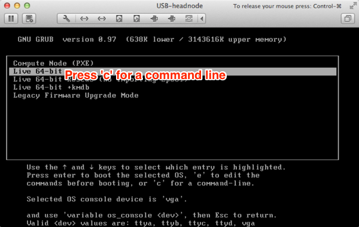

<!--
    This Source Code Form is subject to the terms of the Mozilla Public
    License, v. 2.0. If a copy of the MPL was not distributed with this
    file, You can obtain one at http://mozilla.org/MPL/2.0/.
-->

<!--
    Copyright (c) 2015, Joyent, Inc.
-->

# Set Up CoaL

CoaL stands for "Cloud on a Laptop". It is a VMware virtual appliance for
a SmartDataCenter headnode. It's useful for developing and testing
SmartDataCenter (SDC). This document walks through setting up CoaL.

**WARNING: these steps and command options are not appropriate for
           production deployments.**

The minimum requirements, practically speaking, for a good CoaL experience
is a **Mac with at least 16 GB RAM and an SSD with at least 45 GB disk
available**. Currently, almost all team members using CoaL are on Macs
with VMware Fusion. Vmware Workstation for Linux is used by a few in
the community. VMware Workstation for Windows should work, but has not recently
been tested.

At a high level, setting up CoaL involves:

1. Downloading the latest build.
1. Booting the VMware appliance (virtual machine).
2. Configuring SmartDataCenter.
3. Waiting for the SDC services to automatically install and setup in the
   SDC headnode virtual machine. This can take from 10 to 20 minutes on
   a Mac laptop.
4. Test and develop.


## Run CoaL on VMware

### Download CoaL and Configure VMware

1. Start the download of the latest CoaL build. The tarball is approximately 2 GB.

    curl -C - -O https://us-east.manta.joyent.com/Joyent_Dev/public/SmartDataCenter/coal-latest.tgz

2. Install VMware, if you haven't already.
    - Mac: [VMware Fusion](http://www.vmware.com/products/fusion) 5 or 7.
    - Windows or Linux: [VMware Workstation](http://www.vmware.com/products/workstation).

3. Configure VMware virtual networks for CoaL's "external" and "admin"
   networks. This is a one time configuration for a VMware installation.

    1. Launch VMware at least once after installing VMware.

    2. Run the OS specific CoaL set up script for VMware:

         - Mac:

            ```bash
            curl -s https://raw.githubusercontent.com/joyent/sdc/master/tools/coal-mac-vmware-setup | sudo bash
            ```

         - Linux:

            ```bash
            curl -s https://raw.githubusercontent.com/joyent/sdc/master/tools/coal-linux-vmware-setup | sudo bash
            ```

         - Windows:

            ```
            Download https://raw.githubusercontent.com/joyent/sdc/master/tools/coal-windows-vmware-setup.bat
            Run coal-windows-vmware-setup.bat
            ```

1. Extract the CoaL virtual machine:

    - Mac example:

        ```bash
        $ tar -zxvf coal-latest.tgz -C ~/Documents/Virtual\ Machines.localized
        x root.password.20140911t161518z
        x coal-master-20140911T194415Z-g1a445f5-4gb.vmwarevm/
        x coal-master-20140911T194415Z-g1a445f5-4gb.vmwarevm/USB-headnode.vmx
        x coal-master-20140911T194415Z-g1a445f5-4gb.vmwarevm/zpool.vmdk
        x coal-master-20140911T194415Z-g1a445f5-4gb.vmwarevm/USB-headnode.vmdk
        x coal-master-20140911T194415Z-g1a445f5-4gb.vmwarevm/4gb.img
        ...
        ```

1. Set memory and run.

    - Mac example:

        1. Launch VMware Fusion
        2. File > Open... `coal-<branch>-<build_date_time>-<git_sha1_hash>-4gb.vmwarevm`
        3. Virtual Machine > Settings
        4. Processes & Memory > set memory to 8192 MB or greater. Be sure to
           leave Mac OS X with at least 8 GB.


1. When you are prompted with the GRUB menu press the down arrow.

  1. Select the "Live 64-bit" option and press 'c' to enter the command
     line for GRUB.

     

     By default, the OS will redirect the console to ttyb which is fine
     for production but needs to be changed for CoaL. At the command line enter
     "variable os_console vga":

        ```
        grub> variable os_console vga
        ```

  1. Press enter.

  1. Press esc to get back to the GRUB menu.

  1. Boot "Live 64-bit" by pressing enter.

     If while booting it stays just showing a cursor then you might have
     forgotten to redirect the console, see instructions above.

     

     On boot, being in a virtual environment without Intel VT-x support
     enabled, you'll receive cpu and kvm warnings:

     


### Configure the Headnode

Use the following table to quickly configuration your CoaL with settings that
are fine for development. The table is followed by screenshots.

If you make a mistake while entering the configuration you can restart
the VMware virtual machine. Also, as the onscreen instructions describe,
the last step in configuration allows editing the resulting configuration file.

|Setting|Value|Notes|
|---|---|---|
|*Instructions*|↵||
|Company Name|Clavius||
|Region of Datacenter|orbit||
|Name of Datacenter|coal-1|(Availability zone.) |
|Location of DataCenter|Moon, Earth||
|*Instructions*|↵||
|'admin' interface|2|The second NIC is set up as the admin network by the CoaL networking script|
|(admin) headnode IP address|10.99.99.7|Must use this value.|
|(admin) headnode netmask:|↵|Use the default.|
|(admin) Zone's starting IP address:|↵|Use the default.|
|Add external network now? (Y/n)|↵|Must use this value.|
|'external' interface|1|The first NIC is set up as the external network by the CoaL networking script|
|(external) headnode IP address|10.88.88.200|Must use this value.|
|(external) headnode netmask:|↵|Use the default.|
|(external) gateway IP address:|10.88.88.2|Must use this value.|
|(external) network VLAN ID|↵|Use default. The external network is not on a VLAN in CoaL|
|Starting Provisionable IP address for external Network|↵|Use the default.|
|Ending Provisionable IP address for external Network|↵|Use the default.|
|Default gateway IP address:|↵|Use the default.|
|Primary DNS Server|↵|Use the default.|
|Secondary DNS Server|↵|Use the default.|
|Head node domain name|example.com||
|DNS Search Domain|example.com||
|NTP Server IP Address|↵|Use the default.|
|"root" password|rootpass||
|Confirm "root" password|||
|"admin" password|adminpass1||
|Confirm "admin" password|||
|Administrator's email|↵|Use the default.|
|Support email|↵|Use the default.|
|Enable telemetry|↵|Defaults to false.|
|Verify Configuration||Review the configuration before proceeding.|
|Verify Configuration Again|||

Verify configuration:


## Installation

CoaL will now install based on the configuration parameters entered
above. Installation has been observed to take up to 20 minutes,
particularly if installing on a laptop hard disk drive. It is not
complete **until you see "Setup complete"**.

On a Mac, you will be prompted to enter your admin password, so that the
VM can monitor all network traffic. You may receive this popup a few times:


The next phase of installation completes with notification of a reboot:


The final phase of installation, setup, is the longest and does not show
the progress at the beginning of it. You may see either just a cursor on
the login page or a login prompt:


or


After sometime you will see "preparing for setup":


Finally, you'll see "Setup complete":


## Post Installation

### Root Access

After setup is complete you should be able to ssh into your CoaL
using the admin network headnode IP address you configured.

```bash
ssh root@10.88.88.200  # password 'rootpass'
```

### Health

Let's confirm the health of SDC services:

```bash
root@headnode (coal-1) ~]# sdc-healthcheck
ZONE                                 STATE           AGENT               STATUS
global                               running         -                   online
assets                               running         -                   online
amon                                 running         -                   online
binder                               running         -                   online
rabbitmq                             running         -                   online
napi                                 running         -                   online
fwapi                                running         -                   online
imgapi                               running         -                   online
adminui                              running         -                   online
moray                                running         -                   online
amonredis                            running         -                   online
sapi                                 running         -                   online
workflow                             running         -                   online
mahi                                 running         -                   online
sdc                                  running         -                   online
papi                                 running         -                   online
dhcpd                                running         -                   online
redis                                running         -                   online
ufds                                 running         -                   online
manatee                              running         -                   online
vmapi                                running         -                   online
cnapi                                running         -                   online
ca                                   running         -                   online
global                               running         provisioner         online
global                               running         heartbeat           online
global                               running         ur                  online
global                               running         smartlogin          online
```


### Additional Plumbing

1. Add external nics to imgapi and adminui

   These are required in order to be able to access remote update sources, and
   in order to be able to access AdminUI using a browser:

    ```bash
    [root@headnode (coal-1) ~]# sdcadm post-setup common-external-nics
    Added external nic to adminui
    Added external nic to imgapi
    ```

   Please note that this command didn't wait for the "add nics" jobs to be
   completed, just submitted, so you might need to give it some extra time
   after the command exits until these jobs really finish.

   Let's use "sdc-vmapi" to confirm which services have an external IP:

    ```bash
    root@headnode (coal-1) ~]# sdc-vmapi /vms?state=running | json -H -ga alias nics.0.ip nics.1.ip
    dhcpd0 10.99.99.9
    imgapi0 10.99.99.21 10.88.88.4
    sdc0 10.99.99.28
    workflow0 10.99.99.19
    napi0 10.99.99.10
    fwapi0 10.99.99.26
    assets0 10.99.99.8
    moray0 10.99.99.17
    ufds0 10.99.99.18
    redis0 10.99.99.24
    sapi0 10.99.99.32
    vmapi0 10.99.99.27
    cnapi0 10.99.99.22
    binder0 10.99.99.11
    amonredis0 10.99.99.23
    rabbitmq0 10.99.99.20
    manatee0 10.99.99.16
    papi0 10.99.99.29
    amon0 10.99.99.25
    ca0 10.99.99.30
    mahi0 10.99.99.33
    adminui0 10.99.99.31 10.88.88.3
    ```

   We can now access access the operations portal, "SDC ADMINUI", in a web
   browser on the host computer at https://10.88.88.3/ .

2. Set up CloudAPI

   CloudAPI provides the self-serve API access to SDC. If you are developing or
   testing verses CloudAPI then create the CloudAPI zone:

    ```bash
    root@headnode (coal-1) ~]# sdcadm post-setup cloudapi
    cloudapi0 zone created
    ```

### Configure for Development

If you are setting up CloudAPI in your CoaL and attempting to
provision VMs using that, you'll probably hit an error that there are
no provisionable servers. That's because the headnode is excluded from the
set of servers used for provisioning customer instances.

However, for development and testing, allowing the headnode to act
as a compute node for instances is handy. To enable:

```bash
[root@headnode (coal-1) ~]# sdcadm post-setup dev-headnode-prov
Configuring CNAPI to allow headnode provisioning and over-provisioning (allow a minute to propagate)
```

## Update CoaL

### Set Channel

If this is your first time updating SDC, then you'll want to set the [update channel](../operator-guide/update.md):

```bash
[root@headnode (coal-1) ~]# sdcadm channel set dev
Update channel has been successfully set to: 'dev'
```

### Check Health

1. Confirm the health of CoaL using `sdc-healthcheck`.

### Self Update

1. Update sdcadm:

    ```bash
    [root@headnode (coal-1) ~]# sdcadm --version
    sdcadm 1.4.4 (release-20150205-20150205T060457Z-g7d76790)
    [root@headnode (coal-1) ~]# sdcadm self-update
    Update to sdcadm 1.5.0 (master-20150211T134112Z-gef31015)
    Download update from https://updates.joyent.com
    Run sdcadm installer (log at /var/sdcadm/self-updates/20150217T234531Z/install.log)
    Updated to sdcadm 1.5.0 (master-20150211T134112Z-gef31015, elapsed 7s)
    ```

1. Confirm the updated sdcadm reports SDC as healthy using `sdcadm check-health`.

### Back Up SDC's Brain

Take a ZFS snapsnot of the manatee zone and temporarily store on headnode's drive:

```bash
MANATEE0_UUID=$(vmadm lookup -1 alias=~manatee)
zfs snapshot zones/$MANATEE0_UUID/data/manatee@backup
zfs send zones/$MANATEE0_UUID/data/manatee@backup > /var/tmp/manatee-backup.zfs
zfs destroy zones/$MANATEE0_UUID/data/manatee@backup
```

### Update

You've backed up the Manatee zone, now download and install the updated images for SDC services. This process can take up to 60 minutes depending on how many services have new images.

1. Update global zone tools:

    ```bash
    [root@headnode (coal-1) ~]# sdcadm experimental update-gz-tools --latest
    Downloading gz-tools image 55d74974-8c0b-4126-8ea4-5c246cf412f5 (2.0.0) to /var/tmp/gz-tools-55d74974-8c0b-4126-8ea4-5c246cf412f5.tgz
    Decompressing gz-tools tarball
    Updating "sdc" zone tools
    Updating global zone scripts
    Mounting USB key
    Unmounting USB key
    Updating cn_tools on all compute nodes
    Cleaning up gz-tools tarball
    Updated gz-tools successfully (elapsed 13s).
    ```

1. Update domain name services:

    ```bash
    [root@headnode (coal-1) ~]# sdcadm experimental update-other
    Updating maintain_resolvers for all vm services
    Updating DNS domain service metadata for papi, mahi
    Updating DNS domain SDC application metadata for papi, mahi
    No need to update region_name for this data center
    sapi_domain already present on node.config
    Done.
    ```

1. Update the agents:

    ```bash
    [root@headnode (coal-1) ~]# sdcadm experimental update-agents --latest -y
    Downloading agentsshar image 002774ed-e83d-423d-8d25-f133a588f84c (1.0.0-master-20150226T224702Z-gd3c2031) to /var/tmp/agents-002774ed-e83d-423d-8d25-f133a588f84c.sh
    Executing agents installer across data center
    Done.
    ```

1. Update all the services. This step can take up to 45 minutes depending on how many services have new images.

    ```bash
    [root@headnode (coal-1) /var/tmp]# sdcadm update --all -y
    Finding candidate update images for 23 services (papi, mahi, ca, manatee, amonredis, amon, moray, binder, ufds, cnapi, dhcpd, redis, napi, workflow, fwapi, sdc, adminui, imgapi, vmapi, sapi, cloudapi, manta, assets).
    Note: There are no "cloudapi" instances. Only the service configuration will be updated.
    Note: There are no "manta" instances. Only the service configuration will be updated.
    This update will make the following changes:
        download 22 images (1108 MiB):
            image 85157ca0-bd90-11e4-9016-477613964961 (papi@master-20150226T081600Z-g7905a77)
            image a3012cb0-bde9-11e4-8816-57d15d66624e (manta-authcache@master-20150226T185448Z-g4e3f5d9)
            image 78c965a4-bd8d-11e4-a1bc-2701505c414d (amon@master-20150226T075046Z-g58ecaf8)
            image 6e9b95ec-beb5-11e4-806b-6fc4218e1009 (sdc-postgres@master-20150227T191223Z-gad45608)
            image 30fe9576-bd8f-11e4-9066-63d665bc96ce (manta-nameservice@master-20150226T080343Z-gba090a8)
            image 675087da-beb4-11e4-a9b3-8f914417afff (manta-moray@master-20150227T190616Z-gf7607c7)
            image 970715a8-c16f-11e4-9fae-3f1afe2afdee (cnapi@master-20150303T063214Z-g0c8f661)
            image 0c589eba-c177-11e4-9be7-b3bfec9244fb (dhcpd@master-20150303T072519Z-g54ca866)
            image aaba7218-bd8f-11e4-81df-573bd1d77302 (redis@master-20150226T081228Z-g0d6e5b9)
            image bfc5dac8-bd8d-11e4-a03b-67835b902758 (ufds@master-20150226T075650Z-g9a66af3)
            image 959b6076-bd90-11e4-ae05-6fc0ef56abd1 (workflow@master-20150226T081626Z-g2a160f5)
            image 1ac995dc-bd8d-11e4-89ed-0b706fd9fcfd (napi@master-20150226T074910Z-gbc4a87c)
            image 1fa4af12-bd90-11e4-b420-dfe5cc431999 (fwapi@master-20150226T081200Z-g8601d56)
            image 3862bfbc-c1d7-11e4-8dc0-7b7e574c78b0 (adminui@master-20150303T185212Z-gca114bd)
            image 5231245e-bd8d-11e4-9db9-07ccad0e008e (imgapi@master-20150226T074935Z-gf69e4d4)
            image 2752e4fc-bf0e-11e4-8de7-73e39bcc2a12 (vmapi@master-20150228T054919Z-gb09aea6)
            image cf267ca8-bd91-11e4-941b-5f26cf29c0e5 (sapi@master-20150226T082326Z-g14fa2e4)
            image 26eb639e-c112-11e4-ada8-ffb116cec9d8 (cloudapi@master-20150302T192040Z-g24cfb4d)
            image 6ab73f54-bd8d-11e4-83c2-8b81723a3436 (manta-deployment@master-20150226T075408Z-gc8d74a9)
            image 1ccefc72-bd8e-11e4-b163-df2139248aba (assets@master-20150226T080059Z-g6012d50)
            image f1b6b7e0-bd8e-11e4-8ae4-d3a190985286 (amonredis@master-20150226T080620Z-g4bbca77)
            image 156647c6-c174-11e4-804f-73c1ba84c2f5 (sdc@master-20150303T070134Z-g997645e)
        update "papi" service to image 85157ca0-bd90-11e4-9016-477613964961 (papi@master-20150226T081600Z-g7905a77)
        update "amonredis" service to image f1b6b7e0-bd8e-11e4-8ae4-d3a190985286 (amonredis@master-20150226T080620Z-g4bbca77)
        update "amon" service to image 78c965a4-bd8d-11e4-a1bc-2701505c414d (amon@master-20150226T075046Z-g58ecaf8)
        update "cnapi" service to image 970715a8-c16f-11e4-9fae-3f1afe2afdee (cnapi@master-20150303T063214Z-g0c8f661)
        update "dhcpd" service to image 0c589eba-c177-11e4-9be7-b3bfec9244fb (dhcpd@master-20150303T072519Z-g54ca866)
        update "redis" service to image aaba7218-bd8f-11e4-81df-573bd1d77302 (redis@master-20150226T081228Z-g0d6e5b9)
        update "napi" service to image 1ac995dc-bd8d-11e4-89ed-0b706fd9fcfd (napi@master-20150226T074910Z-gbc4a87c)
        update "workflow" service to image 959b6076-bd90-11e4-ae05-6fc0ef56abd1 (workflow@master-20150226T081626Z-g2a160f5)
        update "fwapi" service to image 1fa4af12-bd90-11e4-b420-dfe5cc431999 (fwapi@master-20150226T081200Z-g8601d56)
        update "sdc" service to image 156647c6-c174-11e4-804f-73c1ba84c2f5 (sdc@master-20150303T070134Z-g997645e)
        update "adminui" service to image 3862bfbc-c1d7-11e4-8dc0-7b7e574c78b0 (adminui@master-20150303T185212Z-gca114bd)
        update "vmapi" service to image 2752e4fc-bf0e-11e4-8de7-73e39bcc2a12 (vmapi@master-20150228T054919Z-gb09aea6)
        update "cloudapi" service to image 26eb639e-c112-11e4-ada8-ffb116cec9d8 (cloudapi@master-20150302T192040Z-g24cfb4d)
        update "manta" service to image 6ab73f54-bd8d-11e4-83c2-8b81723a3436 (manta-deployment@master-20150226T075408Z-gc8d74a9)
        update "assets" service to image 1ccefc72-bd8e-11e4-b163-df2139248aba (assets@master-20150226T080059Z-g6012d50)
        update "imgapi" service to image 5231245e-bd8d-11e4-9db9-07ccad0e008e (imgapi@master-20150226T074935Z-gf69e4d4)
        update "ufds" service to image bfc5dac8-bd8d-11e4-a03b-67835b902758 (ufds@master-20150226T075650Z-g9a66af3)
        update "moray" service to image 675087da-beb4-11e4-a9b3-8f914417afff (manta-moray@master-20150227T190616Z-gf7607c7)
        update "sapi" service to image cf267ca8-bd91-11e4-941b-5f26cf29c0e5 (sapi@master-20150226T082326Z-g14fa2e4)
        update "manatee" service to image 6e9b95ec-beb5-11e4-806b-6fc4218e1009 (sdc-postgres@master-20150227T191223Z-gad45608)
        update "binder" service to image 30fe9576-bd8f-11e4-9066-63d665bc96ce (manta-nameservice@master-20150226T080343Z-gba090a8)
        update "mahi" service to image a3012cb0-bde9-11e4-8816-57d15d66624e (manta-authcache@master-20150226T185448Z-g4e3f5d9)
    Create work dir: /var/sdcadm/updates/20150303T194912Z
    Downloading image 85157ca0-bd90-11e4-9016-477613964961 (papi@master-20150226T081600Z-g7905a77)
    Downloading image a3012cb0-bde9-11e4-8816-57d15d66624e (manta-authcache@master-20150226T185448Z-g4e3f5d9)
    Downloading image 78c965a4-bd8d-11e4-a1bc-2701505c414d (amon@master-20150226T075046Z-g58ecaf8)
    Downloading image 6e9b95ec-beb5-11e4-806b-6fc4218e1009 (sdc-postgres@master-20150227T191223Z-gad45608)
    Imported image a3012cb0-bde9-11e4-8816-57d15d66624e (manta-authcache@master-20150226T185448Z-g4e3f5d9)
    Downloading image 30fe9576-bd8f-11e4-9066-63d665bc96ce (manta-nameservice@master-20150226T080343Z-gba090a8)
    Imported image 30fe9576-bd8f-11e4-9066-63d665bc96ce (manta-nameservice@master-20150226T080343Z-gba090a8)
    Downloading image 675087da-beb4-11e4-a9b3-8f914417afff (manta-moray@master-20150227T190616Z-gf7607c7)
    Imported image 85157ca0-bd90-11e4-9016-477613964961 (papi@master-20150226T081600Z-g7905a77)
    Downloading image 970715a8-c16f-11e4-9fae-3f1afe2afdee (cnapi@master-20150303T063214Z-g0c8f661)
    Imported image 970715a8-c16f-11e4-9fae-3f1afe2afdee (cnapi@master-20150303T063214Z-g0c8f661)
    Downloading image 0c589eba-c177-11e4-9be7-b3bfec9244fb (dhcpd@master-20150303T072519Z-g54ca866)
    Imported image 0c589eba-c177-11e4-9be7-b3bfec9244fb (dhcpd@master-20150303T072519Z-g54ca866)
    Downloading image aaba7218-bd8f-11e4-81df-573bd1d77302 (redis@master-20150226T081228Z-g0d6e5b9)
    Imported image 78c965a4-bd8d-11e4-a1bc-2701505c414d (amon@master-20150226T075046Z-g58ecaf8)
    Downloading image bfc5dac8-bd8d-11e4-a03b-67835b902758 (ufds@master-20150226T075650Z-g9a66af3)
    Imported image aaba7218-bd8f-11e4-81df-573bd1d77302 (redis@master-20150226T081228Z-g0d6e5b9)
    Downloading image 959b6076-bd90-11e4-ae05-6fc0ef56abd1 (workflow@master-20150226T081626Z-g2a160f5)
    Imported image 959b6076-bd90-11e4-ae05-6fc0ef56abd1 (workflow@master-20150226T081626Z-g2a160f5)
    Downloading image 1ac995dc-bd8d-11e4-89ed-0b706fd9fcfd (napi@master-20150226T074910Z-gbc4a87c)
    Imported image 675087da-beb4-11e4-a9b3-8f914417afff (manta-moray@master-20150227T190616Z-gf7607c7)
    Downloading image 1fa4af12-bd90-11e4-b420-dfe5cc431999 (fwapi@master-20150226T081200Z-g8601d56)
    Imported image 1fa4af12-bd90-11e4-b420-dfe5cc431999 (fwapi@master-20150226T081200Z-g8601d56)
    Downloading image 3862bfbc-c1d7-11e4-8dc0-7b7e574c78b0 (adminui@master-20150303T185212Z-gca114bd)
    Imported image 6e9b95ec-beb5-11e4-806b-6fc4218e1009 (sdc-postgres@master-20150227T191223Z-gad45608)
    Downloading image 5231245e-bd8d-11e4-9db9-07ccad0e008e (imgapi@master-20150226T074935Z-gf69e4d4)
    Imported image bfc5dac8-bd8d-11e4-a03b-67835b902758 (ufds@master-20150226T075650Z-g9a66af3)
    Downloading image 2752e4fc-bf0e-11e4-8de7-73e39bcc2a12 (vmapi@master-20150228T054919Z-gb09aea6)
    Imported image 1ac995dc-bd8d-11e4-89ed-0b706fd9fcfd (napi@master-20150226T074910Z-gbc4a87c)
    Downloading image cf267ca8-bd91-11e4-941b-5f26cf29c0e5 (sapi@master-20150226T082326Z-g14fa2e4)
    Imported image 5231245e-bd8d-11e4-9db9-07ccad0e008e (imgapi@master-20150226T074935Z-gf69e4d4)
    Downloading image 26eb639e-c112-11e4-ada8-ffb116cec9d8 (cloudapi@master-20150302T192040Z-g24cfb4d)
    Imported image 2752e4fc-bf0e-11e4-8de7-73e39bcc2a12 (vmapi@master-20150228T054919Z-gb09aea6)
    Downloading image 6ab73f54-bd8d-11e4-83c2-8b81723a3436 (manta-deployment@master-20150226T075408Z-gc8d74a9)
    Imported image 3862bfbc-c1d7-11e4-8dc0-7b7e574c78b0 (adminui@master-20150303T185212Z-gca114bd)
    Downloading image 1ccefc72-bd8e-11e4-b163-df2139248aba (assets@master-20150226T080059Z-g6012d50)
    Imported image 26eb639e-c112-11e4-ada8-ffb116cec9d8 (cloudapi@master-20150302T192040Z-g24cfb4d)
    Downloading image f1b6b7e0-bd8e-11e4-8ae4-d3a190985286 (amonredis@master-20150226T080620Z-g4bbca77)
    Imported image 1ccefc72-bd8e-11e4-b163-df2139248aba (assets@master-20150226T080059Z-g6012d50)
    Downloading image 156647c6-c174-11e4-804f-73c1ba84c2f5 (sdc@master-20150303T070134Z-g997645e)
    Imported image cf267ca8-bd91-11e4-941b-5f26cf29c0e5 (sapi@master-20150226T082326Z-g14fa2e4)
    Imported image f1b6b7e0-bd8e-11e4-8ae4-d3a190985286 (amonredis@master-20150226T080620Z-g4bbca77)
    Imported image 156647c6-c174-11e4-804f-73c1ba84c2f5 (sdc@master-20150303T070134Z-g997645e)
    Imported image 6ab73f54-bd8d-11e4-83c2-8b81723a3436 (manta-deployment@master-20150226T075408Z-gc8d74a9)
    Installing image 85157ca0-bd90-11e4-9016-477613964961 (papi@master-20150226T081600Z-g7905a77)
    Reprovisioning papi VM f36bf6cf-fd0e-457f-8965-edda37e45189
    Wait (60s) for papi instance f36bf6cf-fd0e-457f-8965-edda37e45189 to come up
    Installing image f1b6b7e0-bd8e-11e4-8ae4-d3a190985286 (amonredis@master-20150226T080620Z-g4bbca77)
    Reprovisioning amonredis VM 61d1c261-f7d7-42b6-aa57-64b5660cd5e0
    Wait (60s) for amonredis instance 61d1c261-f7d7-42b6-aa57-64b5660cd5e0 to come up
    Installing image 78c965a4-bd8d-11e4-a1bc-2701505c414d (amon@master-20150226T075046Z-g58ecaf8)
    Reprovisioning amon VM 79681927-a86b-48d7-b65a-d9a069785d25
    Wait (60s) for amon instance 79681927-a86b-48d7-b65a-d9a069785d25 to come up
    Installing image 970715a8-c16f-11e4-9fae-3f1afe2afdee (cnapi@master-20150303T063214Z-g0c8f661)
    Reprovisioning cnapi VM 458f3ec3-eb36-43ba-8833-bfbfba91f88b
    Wait (60s) for cnapi instance 458f3ec3-eb36-43ba-8833-bfbfba91f88b to come up
    Installing image 0c589eba-c177-11e4-9be7-b3bfec9244fb (dhcpd@master-20150303T072519Z-g54ca866)
    Reprovisioning dhcpd VM 3e60a5ce-438d-4497-aa43-7cf6bd8503dd
    Wait (60s) for dhcpd instance 3e60a5ce-438d-4497-aa43-7cf6bd8503dd to come up
    Installing image aaba7218-bd8f-11e4-81df-573bd1d77302 (redis@master-20150226T081228Z-g0d6e5b9)
    Reprovisioning redis VM aba66c50-cdfe-413a-8a10-479a2ca302dd
    Wait (60s) for redis instance aba66c50-cdfe-413a-8a10-479a2ca302dd to come up
    Installing image 1ac995dc-bd8d-11e4-89ed-0b706fd9fcfd (napi@master-20150226T074910Z-gbc4a87c)
    Reprovisioning napi VM 9f3c4cf5-82f6-4dfb-9c85-48129560670e
    Wait (60s) for napi instance 9f3c4cf5-82f6-4dfb-9c85-48129560670e to come up
    Installing image 959b6076-bd90-11e4-ae05-6fc0ef56abd1 (workflow@master-20150226T081626Z-g2a160f5)
    Reprovisioning workflow VM cfd7978b-d6e1-49d3-9673-8265704a1b87
    Wait (60s) for workflow instance cfd7978b-d6e1-49d3-9673-8265704a1b87 to come up
    Installing image 1fa4af12-bd90-11e4-b420-dfe5cc431999 (fwapi@master-20150226T081200Z-g8601d56)
    Reprovisioning fwapi VM ec50f64c-2c4c-44b0-8050-f371d6bb1e49
    Wait (60s) for fwapi instance ec50f64c-2c4c-44b0-8050-f371d6bb1e49 to come up
    Installing image 156647c6-c174-11e4-804f-73c1ba84c2f5 (sdc@master-20150303T070134Z-g997645e)
    Reprovisioning sdc VM d5ae7694-6ad6-4a2c-9675-f19fb075314f
    Wait (60s) for sdc instance d5ae7694-6ad6-4a2c-9675-f19fb075314f to come up
    Installing image 3862bfbc-c1d7-11e4-8dc0-7b7e574c78b0 (adminui@master-20150303T185212Z-gca114bd)
    Reprovisioning adminui VM 75d74108-91a3-4958-a7d8-dedc6feb9cfb
    Wait (60s) for adminui instance 75d74108-91a3-4958-a7d8-dedc6feb9cfb to come up
    Installing image 2752e4fc-bf0e-11e4-8de7-73e39bcc2a12 (vmapi@master-20150228T054919Z-gb09aea6)
    Reprovisioning vmapi VM ead80fc7-7688-4290-9504-440389f836d7
    Wait (60s) for vmapi instance ead80fc7-7688-4290-9504-440389f836d7 to come up
    Update "assets" VM b85bf7d8-0473-46eb-845b-967d201b6e85 user-script
    Installing image 1ccefc72-bd8e-11e4-b163-df2139248aba (assets@master-20150226T080059Z-g6012d50)
    Reprovisioning assets VM b85bf7d8-0473-46eb-845b-967d201b6e85
    Wait (60s) for assets instance b85bf7d8-0473-46eb-845b-967d201b6e85 to come up
    Installing image 5231245e-bd8d-11e4-9db9-07ccad0e008e (imgapi@master-20150226T074935Z-gf69e4d4)
    Reprovisioning imgapi VM 52aca9c6-8d72-4df5-b44c-e9c496e4a510
    Wait (60s) for imgapi instance 52aca9c6-8d72-4df5-b44c-e9c496e4a510 to come up
    Disabling imgapi service
    Running IMGAPI migration-008-new-storage-layout.js
    Running IMGAPI migration-009-backfill-archive.js
    Running IMGAPI migration-010-backfill-billing_tags.js
    Running IMGAPI migration-011-backfill-published_at.js
    Enabling imgapi service
    Running vmadm lookup to get local manatee
    Running manatee-adm to find primary manatee
    Creating ufds buckets backup 20150303T201054479.sql
    Copying backup file to HeadNode
    Moving backup file to /var/sdcadm/ufds-backup
    Installing image bfc5dac8-bd8d-11e4-a03b-67835b902758 (ufds@master-20150226T075650Z-g9a66af3)
    Reprovisioning ufds VM dbb49dbf-b79d-4999-8b3a-00e8e48f6043
    Wait (60s) for ufds instance dbb49dbf-b79d-4999-8b3a-00e8e48f6043 to come up
    Installing image 675087da-beb4-11e4-a9b3-8f914417afff (manta-moray@master-20150227T190616Z-gf7607c7)
    Provisioning Temporary moray VM moray0tmp
    Wait (sleep) for moray instance a9a4eb48-67b2-4f09-9a43-0bcf2a7ed1c5 to come up
    Running vmadm lookup to get tmp instance UUID
    Checking if tmp instace a9a4eb48-67b2-4f09-9a43-0bcf2a7ed1c5 services have errors
    Waiting until a9a4eb48-67b2-4f09-9a43-0bcf2a7ed1c5 instance is in DNS
    Disabling registrar on VM 1c3d73be-4e9d-4aac-9a92-8ee85c6edf22
    Wait until VM 1c3d73be-4e9d-4aac-9a92-8ee85c6edf22 is out of DNS
    Reprovisioning moray VM 1c3d73be-4e9d-4aac-9a92-8ee85c6edf22
    Wait (60s) for moray instance 1c3d73be-4e9d-4aac-9a92-8ee85c6edf22 to come up
    Waiting until 1c3d73be-4e9d-4aac-9a92-8ee85c6edf22 instance is in DNS
    Disabling registrar on VM a9a4eb48-67b2-4f09-9a43-0bcf2a7ed1c5
    Wait until VM a9a4eb48-67b2-4f09-9a43-0bcf2a7ed1c5 is out of DNS
    Stop tmp VM a9a4eb48-67b2-4f09-9a43-0bcf2a7ed1c5
    Destroying tmp VM a9a4eb48-67b2-4f09-9a43-0bcf2a7ed1c5 (moray0tmp)
    Get SAPI current mode
    Installing image cf267ca8-bd91-11e4-941b-5f26cf29c0e5 (sapi@master-20150226T082326Z-g14fa2e4)
    Updating 'sapi-url' in SAPI
    Updating 'sapi-url' in VM c9949452-cae6-44c5-826f-13b7f4d1cb1b
    Verifying if we are on an HA setup
    Provisioning Temporary sapi VM sapi0tmp
    Wait (sleep) for sapi instance af8015de-24be-41b3-b1af-b94d337bdc4c to come up
    Running vmadm lookup to get tmp instance UUID
    Checking if tmp instace af8015de-24be-41b3-b1af-b94d337bdc4c services have errors
    Waiting until af8015de-24be-41b3-b1af-b94d337bdc4c instance is in DNS
    Disabling registrar on VM c9949452-cae6-44c5-826f-13b7f4d1cb1b
    Wait until VM c9949452-cae6-44c5-826f-13b7f4d1cb1b is out of DNS
    Reprovisioning sapi VM c9949452-cae6-44c5-826f-13b7f4d1cb1b
    Wait (60s) for sapi instance c9949452-cae6-44c5-826f-13b7f4d1cb1b to come up
    Waiting until c9949452-cae6-44c5-826f-13b7f4d1cb1b instance is in DNS
    Disabling registrar on VM af8015de-24be-41b3-b1af-b94d337bdc4c
    Wait until VM af8015de-24be-41b3-b1af-b94d337bdc4c is out of DNS
    Stop tmp VM af8015de-24be-41b3-b1af-b94d337bdc4c
    Destroying tmp VM af8015de-24be-41b3-b1af-b94d337bdc4c (sapi0tmp)
    Verifying manatee target version
    Target version is new enough to avoid setting SAPI back to proto mode
    get local manatee
    Running manatee-adm status in local manatee
    Getting Compute Nodes Information for manatee VMs
    Getting SDC's moray vms from VMAPI
    Installing image 6e9b95ec-beb5-11e4-806b-6fc4218e1009 (sdc-postgres@master-20150227T191223Z-gad45608)
    Disabling moray services
    Checking manatee-adm version
    Reprovisioning "primary" manatee
    Reprovisioning 87686cf6-5211-471f-867c-0ae221911043 VM 564deee0-9ceb-4e0b-999c-e50f74a7b6f3
    Wait (60s) for manatee instance 87686cf6-5211-471f-867c-0ae221911043 to come up
    Ensure ONE NODE WRITE MODE
    Enabling moray services
    Waiting (2mins) for moray services to be up
    Looking for zk leader
    Installing image 30fe9576-bd8f-11e4-9066-63d665bc96ce (manta-nameservice@master-20150226T080343Z-gba090a8)
    Updating ZK leader
    Reprovisioning fbbafcc4-b34e-4365-b129-c7ca3c1b7115 VM 564deee0-9ceb-4e0b-999c-e50f74a7b6f3
    Wait (sleep) for binder instance fbbafcc4-b34e-4365-b129-c7ca3c1b7115 to come up
    "mahi" VM already has a delegate dataset
    Installing image a3012cb0-bde9-11e4-8816-57d15d66624e (manta-authcache@master-20150226T185448Z-g4e3f5d9)
    Reprovisioning mahi VM 0ce580dd-725b-4f80-a341-963359802e90
    Wait (60s) for mahi instance 0ce580dd-725b-4f80-a341-963359802e90 to come up
    Updated successfully (elapsed 2297s).
    ```

1. Confirm SDC's health with `sdc-healthcheck` and `sdcadm check-health`.

1. Download and "install" the latest platform image:

    ```bash
    [root@headnode (coal-1) ~]# sdcadm platform install --latest
    Downloading platform 20150312T155347Z (image 6564370e-da8f-4c40-b66e-9c4ba21e9f50) to /var/tmp/platform-master-20150312T155347Z.tgz
    Installing platform image onto USB key
    ==> Mounting USB key
    ==> Staging 20150312T155347Z
    ######################################################################## 100.0%
    ==> Unpacking 20150312T155347Z to /mnt/usbkey/os
    ==> This may take a while...
    ==> Copying 20150312T155347Z to /usbkey/os
    ==> Unmounting USB Key
    ==> Adding to list of available platforms
    ==> Done!
    Platform installer finished successfully
    Proceeding to complete the update
    Updating 'latest' link
    Installation complete
    ```

1. Update the headnode to use the latest platform image.

   Get the version of the latest platform image:
    ```bash
    [root@headnode (coal-1) ~]# LATEST_PLATFORM=$(sdcadm platform list | grep true | cut -d' ' -f1)
    [root@headnode (coal-1) ~]# echo $LATEST_PLATFORM
    20150219T182356Z
    ```

   Assign the latest platform image to the headnode which is included with
   the "--all" servers option on the "sdc platform assign" command:

    ```bash
    [root@headnode (coal-1) ~]# sdcadm platform assign $LATEST_PLATFORM --all
    updating headnode 564dc5bc-f596-6234-8041-bab9c76c2509 to 20150205T055835Z
    Setting boot params for 564dc5bc-f596-6234-8041-bab9c76c2509
    Updating booter cache for servers
    Done updating booter caches
    ```

   Confirm:

    ```bash
    [root@headnode (coal-1) ~]# sdcadm platform list
    VERSION           CURRENT_PLATFORM  BOOT_PLATFORM  LATEST
    20150219T182356Z  0                 1              true
    20150205T055835Z  1                 0              false
    ```

1. Reboot the headnode:

    ```bash
    [root@headnode (coal-1) ~]# reboot
    reboot: Halting 22 zones.
    Connection to 10.88.88.200 closed by remote host.
    ```

1. Log back in and confirm the platform version:

    ```bash
    % ssh root@10.88.88.200
    Password:
    Last login: Thu Feb 19 21:04:24 2015 from 10.88.88.1
     - SmartOS Live Image v0.147+ build: 20150219T182356Z
    ```

1. Run `sdc-healthcheck` until all services go from "error" or "svc-err" to "online".

   You have successfully updated CoaL.

## Additional Operations

See [the Joyent customer documentation](https://docs.joyent.com/sdc7).
